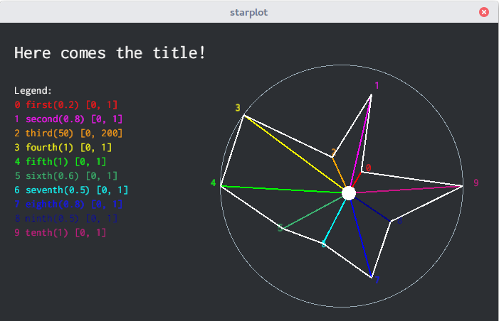

#  starplot-rs

[](https://travis-ci.org/aleics/starplot-rs) [](https://opensource.org/licenses/MIT) 

A tool written in [Rust](https://www.rust-lang.org) for visualization of Star Plots.

## contribute
Everyone is free to contribute. If interested:

    1. Fork the repository: https://github.com/aleics/starplot-rs/Fork
    2. Create your branch: ` $ git checkout -b new-branch`
    3. Commit changes: ` $ git commit -am 'new stuff!'`
    4. Push it to your branch: ` $ git push origin new-branch`
    5. Create a new pull request


## download
Clone the repository as follows:

```
    $ git clone https://github.com/aleics/starplot-rs
```

Or download the repository as a zip.

## build
Enter on the repository directory and build it using `cargo`:

```
    $ cd starplot-rs
    $ cargo build --verbose
```

## run
Go to the `target/debug` or `target/release` folder and execute `main`:

```
    $ cd target/debug
    $ ./main
```

You must see after something similiar as:



Press after `Q` or `ESC` to exit.

## commands

    - `N`: switch night/day view.
    - `Q`: exit the application.
    - `ESC`: exit the application. 